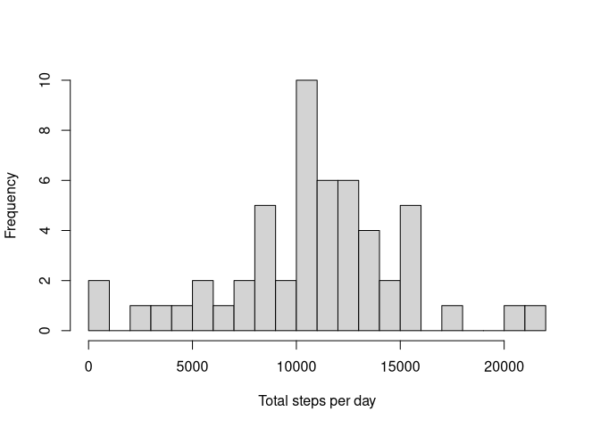
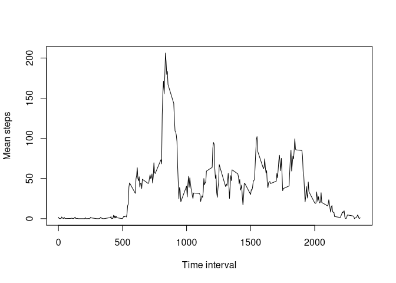
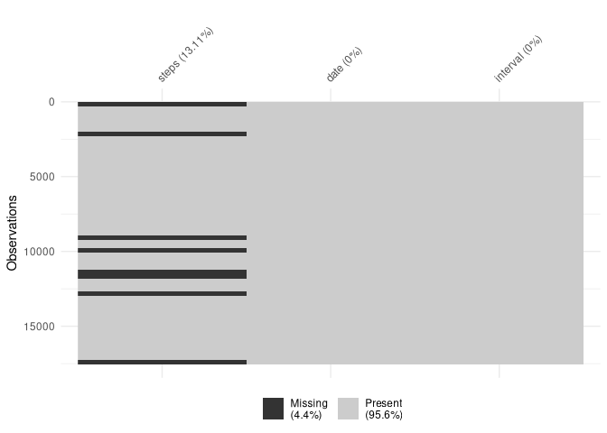
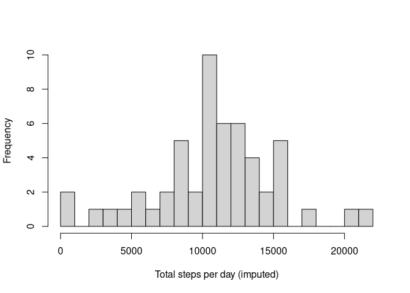
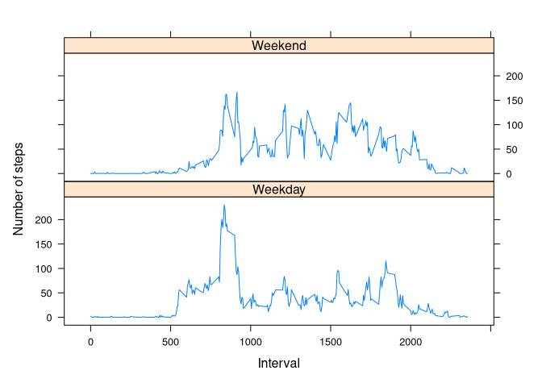

## Loading and preprocessing the data

Show any code that is needed to

1. Load the data (i.e. `read.csv()`)
2. Process/transform the data (if necessary) into a format suitable for your analysis

### Load the data

```r
unzip("activity.zip")
activity <- read.csv("activity.csv")

str(activity)
```

```
## 'data.frame':	17568 obs. of  3 variables:
##  $ steps   : int  NA NA NA NA NA NA NA NA NA NA ...
##  $ date    : chr  "2012-10-01" "2012-10-01" "2012-10-01" "2012-10-01" ...
##  $ interval: int  0 5 10 15 20 25 30 35 40 45 ...
```

### Process/transform the data

```r
activity$date <- as.Date(activity$date)

str(activity)
```

```
## 'data.frame':	17568 obs. of  3 variables:
##  $ steps   : int  NA NA NA NA NA NA NA NA NA NA ...
##  $ date    : Date, format: "2012-10-01" "2012-10-01" ...
##  $ interval: int  0 5 10 15 20 25 30 35 40 45 ...
```

## What is mean total number of steps taken per day?

For this part of the assignment, you can ignore the missing values in the dataset.

1. Calculate the total number of steps taken per day
2. If you do not understand the difference between a histogram and a barplot, research the difference between them. Make a histogram of the total number of steps taken each day.
3. Calculate and report the mean and median of the total number of steps taken per day


### Total number of steps taken per day

```r
total_steps <- tapply(activity$steps, activity$date, sum)
summary(total_steps)
```

```
##    Min. 1st Qu.  Median    Mean 3rd Qu.    Max.    NA's 
##      41    8841   10765   10766   13294   21194       8
```

### Histogram of the total number of steps taken each day

```r
hist(total_steps, 
     breaks = 20,
     main = NA,
     xlab = "Total steps per day")
```



### Mean and median of the total number of steps taken per day

```r
mean_steps <- mean(total_steps, na.rm = TRUE)
median_steps <- median(total_steps, na.rm = TRUE)
```

- The mean of the total number of steps taken per day is 10,766.
- The median of the total number of steps taken per day is 10,765.

## What is the average daily activity pattern?

1. Make a time series plot (i.e. `type = "l"`) of the 5-minute interval (_x_-axis) and the average number of steps taken, averaged across all days (_y_-axis)
2. Which 5-minute interval, on average across all the days in the dataset, contains the maximum number of steps?

### Time series
    

```r
interval_steps <- tapply(activity$steps, activity$interval, mean, na.rm = TRUE)

plot(names(interval_steps), interval_steps, type = "l",
     xlab = "Time interval",
     ylab = "Mean steps")
```



### Maximum number of steps


```r
max_steps <- names(interval_steps)[which.max(interval_steps)]
```

The most active time in the day is at interval 835.

## Imputing missing values

Note that there are a number of days/intervals where there are missing values (coded as `NA`). The presence of missing days may introduce bias into some calculations or summaries of the data.

1. Calculate and report the total number of missing values in the dataset (i.e. the total number of rows with `NA`).
2. Devise a strategy for filling in all of the missing values in the dataset. The strategy does not need to be sophisticated. For example, you could use the mean/median for that day, or the mean for that 5-minute interval, etc.
3. Create a new dataset that is equal to the original dataset but with the missing data filled in.
4. Make a histogram of the total number of steps taken each day and Calculate and report the mean and median total number of steps taken per day. Do these values differ from the estimates from the first part of the assignment? What is the impact of imputing missing data on the estimates of the total daily number of steps?

### Total number of missing values in the dataset


```r
na_steps <- sum(is.na(activity$steps))
```

The total number of missing step counts in the dataset is 2304 (13.1% of all observations).

### Strategy for filling in all of the missing values in the dataset

The image in Figure 3 visualises the missing data points in the activity data. The graph seems to suggest that the data is _Missing Completely at Random_ (MCAR). This means that there is no correlation between missing items and other items (random error, such as equipment failure). Based on this conclusion, we can fill the missing data with the mean value. This is justified by the fact that the distribution of steps is almost normal (median $\approx$ mean)


```r
library(visdat)
vis_miss(activity)
```



### Missing data imputation

```r
library(dplyr)

activity_means <- activity %>% 
  group_by(interval) %>% 
  summarise(mean_steps = round(mean(steps, na.rm = TRUE)))

activity_imputed <- activity %>% 
  left_join(activity_means) %>% 
  mutate(imputed_steps = if_else(is.na(steps), as.integer(mean_steps), steps)) %>% 
  select(date, interval, steps, imputed_steps)

head(activity_imputed)
```

```
##         date interval steps imputed_steps
## 1 2012-10-01        0    NA             2
## 2 2012-10-01        5    NA             0
## 3 2012-10-01       10    NA             0
## 4 2012-10-01       15    NA             0
## 5 2012-10-01       20    NA             0
## 6 2012-10-01       25    NA             2
```

### Histogram of the total number of steps taken each day

```r
total_steps_imputed <- tapply(activity_imputed$steps, activity_imputed$date, sum)

hist(total_steps_imputed, 
     breaks = 20,
     main = NA,
     xlab = "Total steps per day (imputed)")
```



### Impact of imputing missing data on the estimates of the total daily number of steps


```r
mean_steps_imputed <- mean(total_steps_imputed, na.rm = TRUE)
median_steps_imputed <- median(total_steps_imputed, na.rm = TRUE)
```

The difference in mean steps for the original and imputed data is 0 steps and for the median the difference is 0 steps.

Imputation has no impact on the descriptive statistics of this data.


## Are there differences in activity patterns between weekdays and weekends?

For this part the `weekdays()` function may be of some help here. Use the dataset with the filled-in missing values for this part.

1. Create a new factor variable in the dataset with two levels – “weekday” and “weekend” indicating whether a given date is a weekday or weekend day.
2. Make a panel plot containing a time series plot (i.e. `type = "l"`) of the 5-minute interval (_x_-axis) and the average number of steps taken, averaged across all weekday days or weekend days (_y_-axis).


```r
library(lattice)

week_type_steps <- activity_imputed %>% 
  mutate(day = weekdays(activity_imputed$date),
         day_type = as.factor(if_else(day %in% c("Saturday", "Sunday"),
                                      "Weekend", "Weekday"))) %>% 
  group_by(interval, day_type) %>% 
  summarise(mean_step = mean(imputed_steps))

xyplot(data = week_type_steps, 
       mean_step ~ interval | day_type,
       type = "l", 
       layout=c(1,2),
       xlab = "Interval",
       ylab = "Number of steps")
```

<!-- -->

The graph seems to suggest that activity during weekends is slightly higher past the morning peak. Further analysis is required to test this hypothesis.

